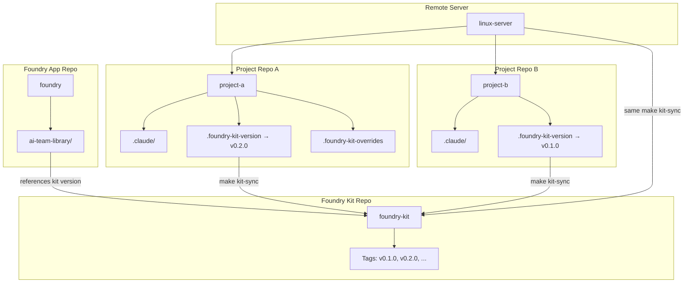
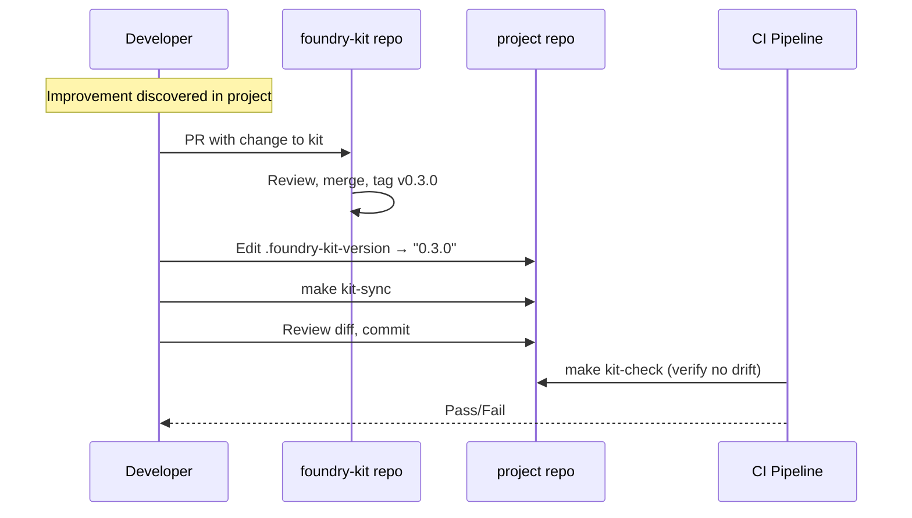

# Foundry Kit Architecture Spec

> **Bean:** BEAN-166 | **Author:** Architect | **Date:** 2026-02-20
> **Status:** Draft

---

## 1. Options Analysis

### 1.1 Git Submodule

A dedicated `foundry-kit` repository added as a git submodule to each consuming project, typically mounted at `.claude/kit/` or `vendor/foundry-kit/`.

**Pros:**
- Version pinning is automatic (submodule locks to a specific commit SHA)
- Git natively tracks the relationship — `git submodule status` shows exact version
- No custom tooling required for basic operations
- Each project can independently upgrade at its own pace
- Works identically on local machines and remote servers

**Cons:**
- Git submodules are notoriously error-prone for teams unfamiliar with them
- `git clone` does not automatically init submodules — requires `--recurse-submodules` or a separate `git submodule update --init`
- Merge conflicts in `.gitmodules` are painful
- Submodule paths are baked into `.gitmodules`, making renames difficult
- CI/CD pipelines need explicit submodule checkout steps
- Nested submodules (if kit itself has dependencies) compound complexity

**Failure Modes:**
- Developer forgets `--recurse-submodules` on clone → missing kit → broken commands
- Detached HEAD state inside submodule confuses developers editing kit files
- Stale submodule pointer after upstream kit changes → silent version drift if not bumped

**Team Workflow:**
- Editing kit: clone kit repo separately, make changes, push, then bump submodule pointer in each consuming project
- Two-step update: `cd vendor/foundry-kit && git pull origin main && cd ../.. && git add vendor/foundry-kit && git commit`
- PR review must check submodule pointer changes

**Remote Workflow:**
- Works out of the box if `git clone --recurse-submodules` is used
- SSH key or token must have access to both the project repo and the kit repo
- No additional infrastructure needed

### 1.2 Git Subtree

The kit repository is merged into each project's tree using `git subtree add/pull`, placing kit files directly in the project's working tree (e.g., at `.claude/kit/`).

**Pros:**
- No `.gitmodules` file — the kit files are regular files in the project repo
- `git clone` just works — no special flags needed
- Developers can edit kit files in-place and contribute changes back via `git subtree push`
- History is preserved (or squashed, per preference)
- No risk of detached HEAD or missing submodule init

**Cons:**
- `git subtree pull` can produce confusing merge history
- Subtree commands are verbose and error-prone (`git subtree pull --prefix=.claude/kit foundry-kit main --squash`)
- No built-in way to see "which kit version am I on?" — requires convention (tag in commit message or version file)
- Merge conflicts during subtree pull are harder to reason about than regular merges
- Project history grows with kit history (unless squashed, which loses granularity)

**Failure Modes:**
- Developer manually edits kit files but forgets to push upstream → drift between project copy and canonical kit
- Subtree pull conflicts compound if projects fall behind multiple kit versions
- No lockfile equivalent — version tracking requires manual discipline

**Team Workflow:**
- Initial setup: `git subtree add --prefix=.claude/kit https://github.com/org/foundry-kit.git main --squash`
- Update: `git subtree pull --prefix=.claude/kit https://github.com/org/foundry-kit.git main --squash`
- Contribute back: `git subtree push --prefix=.claude/kit https://github.com/org/foundry-kit.git feature-branch`

**Remote Workflow:**
- Seamless — files are in the repo, no extra steps
- Remote server just clones the project and everything is present

### 1.3 Symlink Kit (Local Development)

A shared kit directory on the local filesystem (e.g., `~/.foundry-kit/`), with each project symlinking `.claude/kit/ → ~/.foundry-kit/`.

**Pros:**
- Changes to the kit are instantly reflected in all projects — zero update friction
- No git operations needed for kit changes during development
- Fast iteration: edit once, test in any project immediately
- Simple mental model: one canonical copy on the machine

**Cons:**
- Symlinks are not portable across machines without identical filesystem layout
- Windows compatibility is limited (symlinks require developer mode or admin)
- Git does not track symlink targets — `.claude/kit` in the repo points to a local path that may not exist elsewhere
- No version pinning — every project sees the same (latest) kit
- Cannot reproduce a specific project state without knowing which kit version was active at the time
- Breaks in CI/CD unless the CI environment also has the kit at the same path

**Failure Modes:**
- New team member clones repo → broken symlink → confusing error messages
- Remote server filesystem layout differs → symlink target missing
- Two developers have kit at different paths → one's symlinks are another's broken links

**Team Workflow:**
- Each developer clones `foundry-kit` to a conventional path (`~/.foundry-kit/`)
- A setup script creates symlinks in each project
- Updates: `cd ~/.foundry-kit && git pull`

**Remote Workflow:**
- Requires the kit to be cloned at the same conventional path on the remote server
- Ansible/setup script needed to provision the server

### 1.4 Sync Script (Makefile / CLI Command)

A `make kit-sync` or `foundry kit sync` command that copies files from a canonical kit source into the project's `.claude/` directory. The kit source can be a local clone, a remote URL, or a tagged release.

**Pros:**
- Explicit and auditable — every sync produces a git diff showing exactly what changed
- Version pinning via a `.foundry-kit-version` file (tag, branch, or SHA)
- No git submodule/subtree complexity — just file copies
- Works with any transport: git clone, curl from GitHub releases, local path
- Project overrides are natural: just edit the copied files (they're regular files)
- Easy to add drift detection: CI compares project files against kit at pinned version
- Same mechanism works on local, remote, and CI

**Cons:**
- Requires maintaining the sync script/Makefile target
- No automatic tracking of which files were overridden vs. kit-original
- Developer must remember to run `make kit-sync` after bumping version
- Override files can silently regress if sync overwrites them (needs override protection)

**Failure Modes:**
- Developer bumps version but forgets to run sync → version file says v2.0 but files are from v1.9
- Sync overwrites a project-specific override → lost customization (mitigated by override registry)
- Network failure during remote fetch → partial sync (mitigated by atomic copy pattern)

**Team Workflow:**
- Bump version: edit `.foundry-kit-version` to desired tag
- Sync: `make kit-sync` — fetches kit at pinned version, copies non-overridden files
- Override: add file path to `.foundry-kit-overrides` registry, which protects it from sync
- CI check: `make kit-check` verifies no unintended drift

**Remote Workflow:**
- Same commands work on remote server
- Kit source can be a local clone (for air-gapped environments) or GitHub release
- Version file in repo ensures reproducibility

### 1.5 Hybrid: Sync Script + Git Tag Versioning (Recommended Basis)

Combines the sync script approach (1.4) with structured git tag versioning from a dedicated `foundry-kit` repo. This is the approach recommended below in Section 2.

**Why this combination wins:**
- **Simplicity of sync script** — no submodule/subtree footguns
- **Reproducibility of git tags** — `.foundry-kit-version` pins to a semver tag
- **Override protection** — explicit registry prevents accidental overwrites
- **Drift detection** — CI can verify kit files match pinned version (excluding overrides)
- **Identical on all environments** — same `make kit-sync` on laptop, remote server, CI
- **Foundry integration** — the scaffolding pipeline can vendor kit files at generation time

---

## 2. Recommended Architecture

### 2.1 Overview

The Foundry Kit is a separate git repository (`foundry-kit`) containing the canonical shared baseline of Claude Code configuration. Projects consume the kit by pinning a version and syncing files into their `.claude/` directory. Foundry (the app) scaffolds new projects with a vendored snapshot of the kit at the current version.



### 2.2 Foundry Kit Repo Layout

```
foundry-kit/
├── .claude/
│   ├── agents/                  # Shared agent definitions
│   │   ├── architect.md
│   │   ├── ba.md
│   │   ├── developer.md
│   │   ├── team-lead.md
│   │   └── tech-qa.md
│   │
│   ├── commands/                # Shared slash commands
│   │   ├── backlog-refinement.md
│   │   ├── deploy.md
│   │   ├── long-run.md
│   │   ├── run.md
│   │   ├── show-backlog.md
│   │   ├── status-report.md
│   │   ├── trello-add.md
│   │   └── internal/
│   │       ├── merge-bean.md
│   │       ├── new-bean.md
│   │       ├── spawn-bean.md
│   │       ├── trello-load.md
│   │       └── ...
│   │
│   ├── skills/                  # Shared skill implementations
│   │   ├── deploy/SKILL.md
│   │   ├── long-run/SKILL.md
│   │   ├── trello-add/SKILL.md
│   │   └── internal/
│   │       ├── merge-bean/SKILL.md
│   │       └── ...
│   │
│   ├── hooks/                   # Shared hooks
│   │   ├── hook-policy.md
│   │   ├── telemetry-stamp.py
│   │   └── pre-commit-lint.md
│   │
│   └── settings/                # Settings templates
│       ├── settings.json        # Base settings (hooks, MCP servers)
│       └── settings.local.json  # Recommended permissions template
│
├── process/                     # Process templates
│   ├── beans/
│   │   ├── _bean-template.md
│   │   └── _index.md
│   └── context/
│       └── bean-workflow.md
│
├── CLAUDE.md.template           # Template for project CLAUDE.md (Jinja2)
├── Makefile                     # Kit management targets
├── VERSION                      # Current version (e.g., "0.2.0")
├── CHANGELOG.md                 # Kit release notes
└── README.md                    # Kit documentation
```

### 2.3 Project-Side Layout

After `make kit-sync`, a consuming project looks like:

```
project-a/
├── .claude/
│   ├── agents/                  # From kit (or overridden)
│   ├── commands/                # From kit (or overridden)
│   ├── skills/                  # From kit (or overridden)
│   ├── hooks/                   # From kit (or overridden)
│   └── settings.json            # Merged: kit base + project additions
│
├── .foundry-kit-version         # "0.2.0" — pinned kit version
├── .foundry-kit-overrides       # List of files this project intentionally overrides
├── CLAUDE.md                    # Project-specific (generated or hand-written)
├── Makefile                     # Includes kit targets
└── ...                          # Project source code
```

### 2.4 How Foundry Scaffolds New Projects

When Foundry generates a new project via the wizard or CLI:

1. **Read kit version** — The `ai-team-library/` references a kit version (or the user selects one)
2. **Vendor snapshot** — Copy the kit's `.claude/` directory into the new project at the pinned version
3. **Generate CLAUDE.md** — Use `CLAUDE.md.template` from the kit, filled with project-specific data (name, tech stack, personas selected)
4. **Write version file** — Create `.foundry-kit-version` with the kit version used
5. **Write empty overrides** — Create `.foundry-kit-overrides` (empty — no overrides yet)
6. **Include Makefile targets** — Add kit management targets to the project's Makefile

This means every Foundry-generated project is born with a known kit version and the tooling to update it.

### 2.5 How Remote Machines Obtain the Kit

Remote servers use the same mechanism as local machines:

```bash
# One-time setup: clone the kit repo (or it's already available via Foundry)
git clone https://github.com/org/foundry-kit.git ~/.foundry-kit

# In any project:
make kit-sync
```

The `kit-sync` target:
1. Reads `.foundry-kit-version` (e.g., `0.2.0`)
2. Checks if `~/.foundry-kit` exists; if not, clones it
3. Checks out the tagged version: `git -C ~/.foundry-kit checkout v0.2.0`
4. Copies kit files into `.claude/`, skipping files listed in `.foundry-kit-overrides`
5. Merges `settings.json` (kit base + project additions) rather than overwriting

Environment variables for Trello (and other MCP servers) are sourced from the shell environment, not from committed files. The kit's `settings.json` references them via `${TRELLO_API_KEY}` syntax, which Claude Code resolves at runtime.

### 2.6 Update Flow



**Contributing changes back to the kit:**
1. Developer discovers an improvement while working in a project
2. Developer opens a PR against `foundry-kit` with the change
3. Kit maintainer reviews, merges, and tags a new version
4. Developer bumps `.foundry-kit-version` in the project and runs `make kit-sync`
5. The resulting diff is committed as a normal project change

### 2.7 Conflict Handling & Precedence Rules

**Precedence order (highest to lowest):**
1. **Project override** — Files listed in `.foundry-kit-overrides` are never touched by sync
2. **Kit files** — The canonical version from the kit at the pinned version
3. **Foundry-generated defaults** — What Foundry scaffolded at project creation time

**Override registration:**

```
# .foundry-kit-overrides
# Files listed here are managed by this project and will NOT be overwritten by kit-sync.
# Format: path relative to project root
.claude/skills/long-run/SKILL.md
.claude/commands/deploy.md
```

**Conflict detection:**
- `make kit-check` compares every non-overridden file against the kit at the pinned version
- Any difference is reported as drift (either the project was edited without registering an override, or the kit was updated without syncing)
- CI runs `make kit-check` on every PR to catch accidental drift

**Settings merge strategy:**
- `settings.json` is special — it's **merged**, not overwritten
- Kit provides the base hooks and MCP server configs
- Project can add additional hooks, MCP servers, or permissions
- Merge is key-level: project keys override kit keys, but kit keys not present in project are preserved
- A `make kit-settings-merge` target handles this automatically

### 2.8 Versioning Strategy

**Semantic versioning (semver-ish):**
- `MAJOR.MINOR.PATCH` — e.g., `0.2.0`, `1.0.0`
- **MAJOR:** Breaking changes (renamed commands, removed skills, changed hook behavior)
- **MINOR:** New features (new commands, new agents, new skill capabilities)
- **PATCH:** Bug fixes (typo fixes, clarified instructions, minor improvements)

**Tagging:**
- Every release is tagged in the kit repo: `v0.2.0`
- Tags are immutable — once tagged, that version never changes
- `CHANGELOG.md` in the kit documents every release

**Compatibility:**
- Kit version `0.x` is pre-stable — breaking changes may occur in minor versions
- Kit version `1.x+` follows strict semver
- The kit's `CLAUDE.md.template` includes a `kit-version` comment so generated CLAUDE.md files are traceable

### 2.9 Claude Code Version Compatibility

- The kit includes a `claude-code-compat` field in its `VERSION` file: `claude-code: >=1.0.0`
- If Claude Code introduces breaking changes to skills/commands/hooks APIs, a new kit major version is released
- Projects pinning an older kit version continue to work with their compatible Claude Code version
- Migration guides are provided in `CHANGELOG.md` for major version bumps

### 2.10 Trello Integration Architecture

**Where Trello skills/commands live:**
- Kit provides: `/trello-add` skill, `/trello-load` command, Trello MCP server config in `settings.json`
- These are shared — every project consuming the kit gets Trello integration automatically

**How `/backlog-refinement` triggers Trello card creation:**
1. `/backlog-refinement` produces beans with acceptance criteria
2. The bean's `## Trello` section is populated with card metadata
3. `/trello-add` (or `/trello-load` in reverse) creates/updates cards
4. Bean ID is stored on the Trello card as a custom field or in the description

**Idempotency (Bean ID → Card):**
- Each bean has a unique `BEAN-NNN` identifier
- When creating a Trello card, the bean ID is included in the card description: `[Bean: BEAN-NNN]`
- Before creating a new card, the system searches existing cards for `[Bean: BEAN-NNN]`
- If found: update the existing card (name, description, labels)
- If not found: create a new card
- This makes `/trello-load` and card creation deterministic and safe to re-run

**Configuration storage:**
- Trello API credentials are **never committed** to git
- They are stored as environment variables: `TRELLO_API_KEY`, `TRELLO_TOKEN`
- The kit's `settings.json` references them via `${TRELLO_API_KEY}` syntax
- On local machines: set in `~/.bashrc`, `~/.zshrc`, or a `.env` file loaded by direnv
- On remote servers: set in the shell profile or a secrets manager
- The kit includes a `settings.local.json` template showing the recommended permission setup (this file is gitignored)

**Environment parity (local ↔ remote):**
- Same `settings.json` on both environments — MCP server config is identical
- Same env vars (`TRELLO_API_KEY`, `TRELLO_TOKEN`) on both environments
- Same skills and commands — the kit ensures behavioral parity
- Board ID can be configured per-project via a `.foundry-kit-local` config file (gitignored) or as an env var (`TRELLO_BOARD_ID`)

---

## 3. Implementation Plan

### 3.1 Migration Steps

**Phase 1: Create the Kit Repo (Week 1)**

1. Create `foundry-kit` repository on GitHub
2. Extract shared configuration from Foundry's `.claude/` directory:
   - Copy agents, commands, skills, hooks to kit repo's `.claude/` structure
   - Copy process templates (bean-template, index, bean-workflow)
   - Create `CLAUDE.md.template` from current CLAUDE.md with Jinja2 placeholders
3. Create `VERSION` file (`0.1.0`), `CHANGELOG.md`, `README.md`
4. Create `Makefile` with kit management targets (see 3.2)
5. Tag `v0.1.0`

**Phase 2: Build Sync Tooling (Week 1–2)**

6. Write `kit-sync` Makefile target:
   ```makefile
   KIT_VERSION := $(shell cat .foundry-kit-version 2>/dev/null || echo "latest")
   KIT_DIR := $(HOME)/.foundry-kit
   KIT_REPO := https://github.com/org/foundry-kit.git

   .PHONY: kit-sync kit-check kit-init

   kit-init:
   	@if [ ! -d "$(KIT_DIR)" ]; then \
   		git clone $(KIT_REPO) $(KIT_DIR); \
   	fi

   kit-sync: kit-init
   	@cd $(KIT_DIR) && git fetch --tags && git checkout v$(KIT_VERSION)
   	@python3 $(KIT_DIR)/scripts/sync.py \
   		--source $(KIT_DIR) \
   		--target . \
   		--overrides .foundry-kit-overrides \
   		--version $(KIT_VERSION)
   	@echo "Kit synced to v$(KIT_VERSION)"

   kit-check: kit-init
   	@cd $(KIT_DIR) && git fetch --tags && git checkout v$(KIT_VERSION)
   	@python3 $(KIT_DIR)/scripts/check.py \
   		--source $(KIT_DIR) \
   		--target . \
   		--overrides .foundry-kit-overrides
   ```

7. Write `scripts/sync.py` — the sync script:
   - Reads override registry
   - Copies kit files to project, skipping overrides
   - Merges `settings.json` (deep merge, project keys win)
   - Reports: files copied, files skipped (overrides), files unchanged

8. Write `scripts/check.py` — the drift detection script:
   - Compares each non-overridden project file against kit version
   - Reports drift as a list of files with diffs
   - Exit code 0 = clean, 1 = drift detected

**Phase 3: Migrate Foundry Itself (Week 2)**

9. Foundry becomes the first consumer of the kit:
   - Create `.foundry-kit-version` → `0.1.0`
   - Create `.foundry-kit-overrides` (list any Foundry-specific customizations)
   - Run `make kit-sync` to verify everything matches
   - Commit the migration

10. Update `ai-team-library/` to reference kit versions:
    - Library commands/skills/hooks point to kit equivalents
    - Foundry generation pipeline vendors kit files instead of copying from library
    - Library retains persona definitions, stack guides, and templates (these are Foundry-specific, not kit content)

**Phase 4: Integrate with Foundry Generation (Week 2–3)**

11. Update Foundry's generator to vendor kit at scaffold time:
    - `scaffold.py` creates `.foundry-kit-version` in generated projects
    - `asset_copier.py` sources shared assets from kit rather than library
    - `compiler.py` uses `CLAUDE.md.template` from kit
    - Generated `Makefile` includes kit targets

12. Add kit version selection to the Foundry wizard:
    - Version dropdown or "latest" toggle
    - Preview of what the kit version includes

**Phase 5: CI & Documentation (Week 3)**

13. Add CI checks:
    - `make kit-check` runs in CI for every PR
    - Fails if non-overridden files drift from pinned kit version
    - Separate CI job for the kit repo itself (lint, validate SKILL.md structure)

14. Write documentation:
    - Kit README: installation, usage, contributing
    - Migration guide: moving existing projects to kit-based setup
    - Override guide: how to customize without breaking sync
    - Troubleshooting: common issues and resolutions

**Phase 6: Rollout to Other Projects (Week 3–4)**

15. For each existing project:
    - Add `.foundry-kit-version`, `.foundry-kit-overrides`
    - Run `make kit-sync`
    - Review diff, register any project-specific files as overrides
    - Commit and verify CI passes

### 3.2 Minimum Viable Scripts

**`scripts/sync.py`** — Core sync logic (Python, no external deps):

```python
#!/usr/bin/env python3
"""Sync foundry-kit files into a project, respecting overrides."""

import argparse, json, shutil
from pathlib import Path

def load_overrides(path: Path) -> set[str]:
    if not path.exists():
        return set()
    return {line.strip() for line in path.read_text().splitlines()
            if line.strip() and not line.startswith('#')}

def deep_merge(base: dict, override: dict) -> dict:
    result = base.copy()
    for key, value in override.items():
        if key in result and isinstance(result[key], dict) and isinstance(value, dict):
            result[key] = deep_merge(result[key], value)
        else:
            result[key] = value
    return result

def sync(source: Path, target: Path, overrides: set[str], version: str):
    copied, skipped, unchanged = [], [], []
    kit_claude = source / '.claude'
    target_claude = target / '.claude'

    for src_file in kit_claude.rglob('*'):
        if src_file.is_dir():
            continue
        rel = src_file.relative_to(source)
        dst = target / rel
        rel_str = str(rel)

        if rel_str in overrides:
            skipped.append(rel_str)
            continue

        # Special handling for settings.json — merge instead of overwrite
        if rel.name == 'settings.json' and dst.exists():
            kit_settings = json.loads(src_file.read_text())
            proj_settings = json.loads(dst.read_text())
            merged = deep_merge(kit_settings, proj_settings)
            if json.loads(dst.read_text()) != merged:
                dst.write_text(json.dumps(merged, indent=2) + '\n')
                copied.append(rel_str)
            else:
                unchanged.append(rel_str)
            continue

        dst.parent.mkdir(parents=True, exist_ok=True)
        if dst.exists() and dst.read_bytes() == src_file.read_bytes():
            unchanged.append(rel_str)
        else:
            shutil.copy2(src_file, dst)
            copied.append(rel_str)

    print(f"Kit v{version}: {len(copied)} updated, {len(skipped)} overrides skipped, {len(unchanged)} unchanged")
    for f in copied:
        print(f"  + {f}")
    for f in skipped:
        print(f"  ~ {f} (override)")
```

**`scripts/check.py`** — Drift detection:

```python
#!/usr/bin/env python3
"""Check for drift between project .claude/ and pinned kit version."""

import argparse, json, sys
from pathlib import Path

def load_overrides(path: Path) -> set[str]:
    if not path.exists():
        return set()
    return {line.strip() for line in path.read_text().splitlines()
            if line.strip() and not line.startswith('#')}

def check(source: Path, target: Path, overrides: set[str]):
    drifted = []
    kit_claude = source / '.claude'

    for src_file in kit_claude.rglob('*'):
        if src_file.is_dir():
            continue
        rel = src_file.relative_to(source)
        dst = target / rel
        rel_str = str(rel)

        if rel_str in overrides:
            continue

        if not dst.exists():
            drifted.append((rel_str, 'missing'))
        elif dst.read_bytes() != src_file.read_bytes():
            drifted.append((rel_str, 'modified'))

    if drifted:
        print(f"DRIFT DETECTED: {len(drifted)} file(s)")
        for f, reason in drifted:
            print(f"  ! {f} ({reason})")
        sys.exit(1)
    else:
        print("No drift detected. Kit files match pinned version.")
```

### 3.3 CI Checks

```yaml
# .github/workflows/kit-check.yml
name: Kit Drift Check
on: [pull_request]
jobs:
  kit-check:
    runs-on: ubuntu-latest
    steps:
      - uses: actions/checkout@v4
      - run: make kit-check
```

### 3.4 Documentation Outline

| Document | Location | Audience |
|----------|----------|----------|
| Kit README | `foundry-kit/README.md` | All consumers |
| Installation Guide | `foundry-kit/docs/install.md` | New project setup |
| Override Guide | `foundry-kit/docs/overrides.md` | Project customizers |
| Contributing to Kit | `foundry-kit/CONTRIBUTING.md` | Kit developers |
| Migration Guide | `foundry-kit/docs/migration.md` | Existing projects |
| Version History | `foundry-kit/CHANGELOG.md` | All consumers |
| Troubleshooting | `foundry-kit/docs/troubleshooting.md` | All consumers |

### 3.5 Trello Test Plan

1. **Sandbox board** — Create a `foundry-kit-test` Trello board for integration testing
2. **Dry-run mode** — `make kit-trello-test --dry-run` simulates card creation without touching real boards
3. **Idempotency test:**
   - Run `/backlog-refinement` to create 3 test beans
   - Run Trello card creation — verify 3 cards created
   - Run Trello card creation again — verify 0 new cards (idempotent)
   - Modify one bean — verify 1 card updated, 2 unchanged
4. **Rollback:**
   - If card creation fails mid-batch, the system logs which cards were created
   - Re-running the batch picks up where it left off (idempotent by design)
5. **Multi-machine test:**
   - Run Trello operations from local machine → verify cards created
   - Run same operations from remote server → verify same cards found (not duplicated)

---

## 4. Examples

### 4.1 Project Consuming Kit v0.3.1 with Override of /long-run Only

```bash
# Project setup
$ cat .foundry-kit-version
0.3.1

$ cat .foundry-kit-overrides
# Project-specific long-run with custom parallel worker count
.claude/skills/long-run/SKILL.md
.claude/commands/long-run.md

# Sync kit — long-run files are protected
$ make kit-sync
Kit v0.3.1: 42 updated, 2 overrides skipped, 0 unchanged
  + .claude/agents/architect.md
  + .claude/agents/ba.md
  ...
  ~ .claude/skills/long-run/SKILL.md (override)
  ~ .claude/commands/long-run.md (override)

# Verify no drift
$ make kit-check
No drift detected. Kit files match pinned version.

# The project's custom long-run is untouched, everything else matches kit v0.3.1
```

**Directory state after sync:**
```
project/
├── .claude/
│   ├── agents/          ← from kit v0.3.1
│   ├── commands/
│   │   ├── deploy.md    ← from kit v0.3.1
│   │   ├── long-run.md  ← PROJECT OVERRIDE (not touched by sync)
│   │   └── ...          ← from kit v0.3.1
│   ├── skills/
│   │   ├── long-run/
│   │   │   └── SKILL.md ← PROJECT OVERRIDE (not touched by sync)
│   │   ├── deploy/
│   │   │   └── SKILL.md ← from kit v0.3.1
│   │   └── ...
│   └── hooks/           ← from kit v0.3.1
├── .foundry-kit-version   → "0.3.1"
├── .foundry-kit-overrides → lists long-run files
└── CLAUDE.md              ← project-specific
```

### 4.2 Remote Server Running 3 Repos with Same Kit Version

```bash
# Remote server setup (one-time)
ssh remote-server
git clone https://github.com/org/foundry-kit.git ~/.foundry-kit

# Each project pins its own version
$ cat ~/projects/api-service/.foundry-kit-version
0.3.1

$ cat ~/projects/web-app/.foundry-kit-version
0.3.1

$ cat ~/projects/data-pipeline/.foundry-kit-version
0.3.1

# Sync all three projects
$ for proj in api-service web-app data-pipeline; do
    cd ~/projects/$proj
    make kit-sync
    echo "---"
  done

Kit v0.3.1: 44 updated, 0 overrides skipped, 0 unchanged
---
Kit v0.3.1: 44 updated, 1 overrides skipped, 0 unchanged
---
Kit v0.3.1: 44 updated, 0 overrides skipped, 0 unchanged

# All three repos now have identical kit files (except web-app's one override)
# Trello integration works identically on all three — same env vars, same MCP config

# Environment variables (set in ~/.bashrc on remote)
export TRELLO_API_KEY="abc123"
export TRELLO_TOKEN="xyz789"
export TRELLO_BOARD_ID="698e9e614a5e03d0ed57f638"
```

### 4.3 /backlog-refinement Generating 7 Beans and Creating 7 Trello Cards

```bash
# Developer runs backlog refinement in a project
$ claude /backlog-refinement

# The skill creates 7 beans:
# BEAN-201: Add OAuth2 support
# BEAN-202: Migrate to PostgreSQL
# BEAN-203: Add rate limiting
# BEAN-204: Implement webhook system
# BEAN-205: Add API versioning
# BEAN-206: Create admin dashboard
# BEAN-207: Add audit logging

# Each bean's ## Trello section is populated:
# | **Source** | Trello |
# | **Board** | Project Board (ID: abc123) |
# | **Card ID** | <to be created> |
# ...

# After bean creation, Trello cards are created:
$ claude /trello-add --batch
Creating Trello cards for 7 beans...
  ✓ BEAN-201: Add OAuth2 support → card 6a1b2c3d
  ✓ BEAN-202: Migrate to PostgreSQL → card 7e4f5g6h
  ✓ BEAN-203: Add rate limiting → card 8i9j0k1l
  ✓ BEAN-204: Implement webhook system → card 2m3n4o5p
  ✓ BEAN-205: Add API versioning → card 6q7r8s9t
  ✓ BEAN-206: Create admin dashboard → card 0u1v2w3x
  ✓ BEAN-207: Add audit logging → card 4y5z6a7b
7 cards created, 0 updated, 0 skipped

# Re-running is idempotent:
$ claude /trello-add --batch
Creating Trello cards for 7 beans...
  = BEAN-201: Add OAuth2 support → card 6a1b2c3d (unchanged)
  = BEAN-202: Migrate to PostgreSQL → card 7e4f5g6h (unchanged)
  ...
0 cards created, 0 updated, 7 skipped (already exist)

# Modify BEAN-201's title and re-run:
$ claude /trello-add --batch
Creating Trello cards for 7 beans...
  ↑ BEAN-201: Add OAuth2 + SAML support → card 6a1b2c3d (updated)
  = BEAN-202 through BEAN-207 (unchanged)
0 cards created, 1 updated, 6 skipped
```

### 4.4 Emergency Hotfix in Kit and Rolling It Out Safely

**Scenario:** A critical bug is discovered in the kit's `telemetry-stamp.py` hook — it corrupts bean duration timestamps.

```bash
# Step 1: Fix in the kit repo
$ cd ~/.foundry-kit
$ git checkout -b fix/telemetry-timestamp-bug
# ... fix the bug ...
$ git commit -m "Fix telemetry timestamp corruption in hook"
$ git push origin fix/telemetry-timestamp-bug

# Step 2: Fast-track review and merge
# PR is reviewed and merged to main

# Step 3: Tag a patch release
$ git checkout main && git pull
$ echo "0.3.2" > VERSION
$ git tag v0.3.2
$ git push origin v0.3.2

# Step 4: Roll out to affected projects
# Option A: One project at a time (safe)
$ cd ~/projects/api-service
$ echo "0.3.2" > .foundry-kit-version
$ make kit-sync
Kit v0.3.2: 1 updated, 0 overrides skipped, 43 unchanged
  + .claude/hooks/telemetry-stamp.py
$ git add . && git commit -m "Bump kit to v0.3.2 (telemetry fix)"

# Option B: Batch update script for all projects
$ for proj in api-service web-app data-pipeline; do
    cd ~/projects/$proj
    echo "0.3.2" > .foundry-kit-version
    make kit-sync
    git add . && git commit -m "Bump kit to v0.3.2 (telemetry fix)"
    git push
    echo "=== $proj updated ==="
  done

# Step 5: Verify
$ cd ~/projects/api-service && make kit-check
No drift detected. Kit files match pinned version.

# Projects that don't upgrade immediately continue to work on v0.3.1
# The bug only affects telemetry, not functionality — no urgency to force-upgrade
```

**Rollback if the fix introduces a regression:**

```bash
# Revert to previous version
$ echo "0.3.1" > .foundry-kit-version
$ make kit-sync
Kit v0.3.1: 1 updated, 0 overrides skipped, 43 unchanged
  + .claude/hooks/telemetry-stamp.py  (reverted)
$ git add . && git commit -m "Rollback kit to v0.3.1 (regression in v0.3.2)"
```

---

## 5. Decision Summary

| Decision | Choice | Rationale |
|----------|--------|-----------|
| **Distribution mechanism** | Sync script + git tags | Simplest for teams, no submodule footguns, explicit version pinning |
| **Kit repo** | Separate `foundry-kit` repo | Clean separation of concerns, independent versioning |
| **Override strategy** | Explicit registry file | Prevents accidental overwrites, discoverable, auditable |
| **Settings handling** | Deep merge | Projects extend kit settings without losing kit defaults |
| **Versioning** | Semver tags | Industry standard, compatible with tooling |
| **Trello credentials** | Environment variables | Never committed, works on all environments |
| **Trello idempotency** | Bean ID in card description | Simple, searchable, no custom fields needed |
| **CI enforcement** | `make kit-check` in PR pipeline | Catches drift before merge |
| **Foundry integration** | Vendor snapshot at generation time | New projects are born with a known kit version |

---

## Appendix A: Glossary

| Term | Definition |
|------|------------|
| **Kit** | The canonical shared configuration baseline (`foundry-kit` repo) |
| **Kit version** | A semver-tagged release of the kit (e.g., `v0.3.1`) |
| **Vendor** | The act of copying kit files into a project at a specific version |
| **Override** | A project-specific file that replaces a kit file, registered in `.foundry-kit-overrides` |
| **Drift** | When a project's kit files differ from the pinned kit version (excluding registered overrides) |
| **Sync** | The process of updating a project's kit files to match the pinned version |
